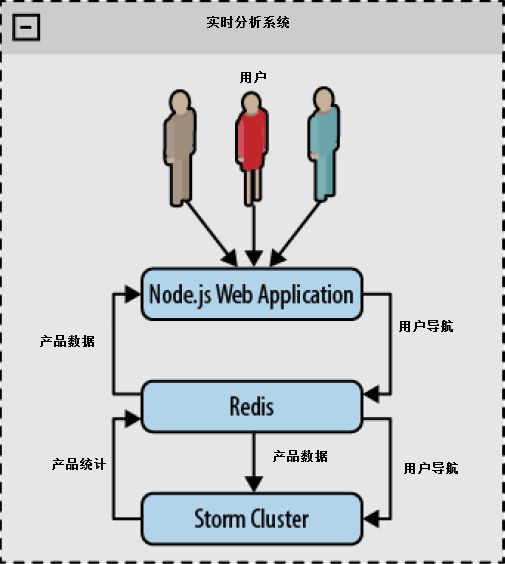
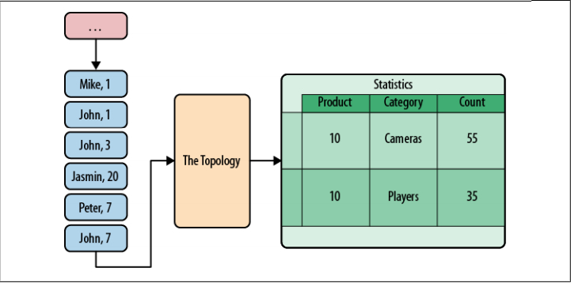
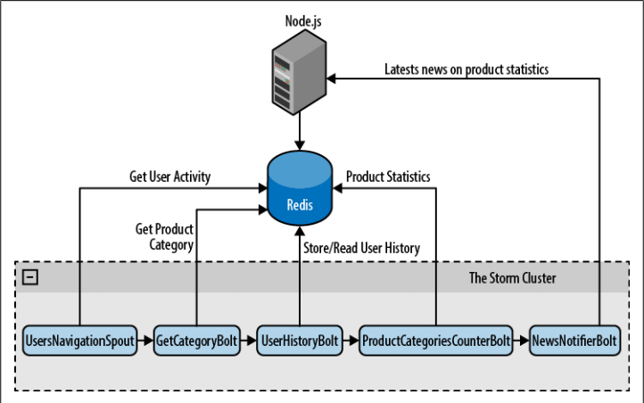
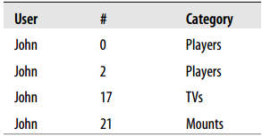
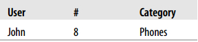
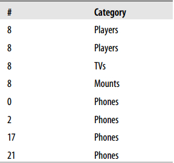
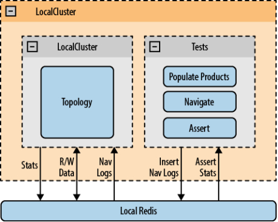

# 一个实际的例子  
 
本章要阐述一个典型的网络分析解决方案，而这类问题通常利用 Hadoop 批处理作为解决方案。与 Hadoop 不同的是，基于 Storm 的方案会实时输出结果。

我们的这个例子有三个主要组件

- 一个基于 Node.js 的 web 应用，用于测试系统
- 一个 Redis 服务器，用于持久化数据
- 一个 Storm 拓扑，用于分布式实时处理数据
  
  

图 架构概览

**NOTE**:你如果想先把这个例子运行起来，请首先阅读附录C

### 基于 Node.js 的 web 应用

我们已经伪造了简单的电子商务网站。这个网站只有三个页面：一个主页、一个产品页和一个产品统计页面。这个应用基于 [Express](http://expressjs.com/) 和 [Socket.io](http://socket.io/) 两个框架实现了向浏览器推送内容更新。制作这个应用的目的是为了让你体验 Storm 集群功能并看到处理结果，但它不是本书的重点，所以我们不会对它的页面做更详细描述。

### *主页*

这个页面提供了全部有效产品的链接。它从Redis服务器获取数据并在页面上把它们显示出来。这个页面的URL是http://localhost:3000/。

### 有效产品：

DVD 播放器（带环绕立体声系统）

全高清蓝光 dvd 播放器

媒体播放器（带 USB 2.0 接口）

全高清摄像机

防水高清摄像机

防震防水高清摄像机

反射式摄像机

双核安卓智能手机（带 64GB SD卡）

普通移动电话

卫星电话

64GB SD 卡

32GB SD 卡

16GB SD 卡

粉红色智能手机壳

黑色智能手机壳

小山羊皮智能手机壳

### *产品页*

产品页用来显示指定产品的相关信息，例如，价格、名称、分类。这个页面的URL是：http://localhost:3000/product/:id。  

### 产品页：32英寸液晶电视

分类：电视机

价格：400

相关分类

### *产品统计页*

这个页面显示通过收集用户浏览站点，用Storm集群计算的统计信息。可以显示为如下概要：浏览这个产品的用户，在那些分类下面浏览了n次产品。该页的URL是：http://localhost:3000/product/:id/stats。

### 浏览了该产品的用户也浏览了以下分类的产品：

1. 摄像机

2. 播放器

3. 手机壳

4. 存储卡

## 启动这个 Node.js web 应用  

首先启动 Redis 服务器，然后执行如下命令启动 web 应用：
  
```
    node webapp/app.js  
```  

为了向你演示，这个应用会自动向 Redis 填充一些产品数据作为样本。

## Storm 拓扑  

为这个系统搭建 Storm 拓扑的目标是改进产品统计的实时性。产品统计页显示了一个分类计数器列表，用来显示访问了其它同类产品的用户数。这样可以帮助卖家了解他们的用户需求。拓扑接收浏览日志，并更新产品统计结果



图 Storm 拓扑的输入与输出

我们的 Storm 拓扑有五个组件：一个 spout 向拓扑提供数据，四个 bolt 完成统计任务。

UsersNavigationSpout

从用户浏览数据队列读取数据发送给拓扑

GetCategoryBolt

从Redis服务器读取产品信息，向数据流添加产品分类

UserHistoryBolt

读取用户以前的产品浏览记录，向下一步分发Product:Category键值对，在下一步更新计数器

**ProductCategoriesCounterBolt**

追踪用户浏览特定分类下的商品次数

NewsNotifierBolt

通知web应用立即更新用户界面

下图展示了拓扑的工作方式（见图6-6）
   
```
package storm.analytics;
...
public class TopologyStarter {
    public static void main(String[] args) {
        Logger.getRootLogger().removeAllAppenders();
        TopologyBuilder builder = new TopologyBuilder();
        builder.setSpout("read-feed", new UsersNavigationSpout(),3);
        builder.setBolt("get-categ", new GetCategoryBolt(),3)
               .shuffleGrouping("read-feed");
        builder.setBolt("user-history", new UserHistoryBolt(),5)
               .fieldsGrouping("get-categ", new Fields("user"));
        builder.setBolt("product-categ-counter", new ProductCategoriesCounterBolt(),5)
               .fieldsGrouping("user-history", new Fields("product"));
        builder.setBolt("news-notifier", new NewsNotifierBolt(),5)
               .shuffleGrouping("product-categ-counter");

        Config conf = new Config();
        conf.setDebug(true);
        conf.put("redis-host",REDIS_HOST);
        conf.put("redis-port",REDIS_PORT);
        conf.put("webserver", WEBSERVER);

        LocalCluster cluster = new LocalCluster();
        cluster.submitTopology("analytics", conf, builder.createTopology());
    }
}  
```  
  

Figure Storm拓扑

**UsersNavigationSpout**

UsersNavigationSpout 负责向拓扑提供浏览数据。每条浏览数据都是一个用户浏览过的产品页的引用。它们都被 web 应用保存在 Redis 服务器。我们一会儿就要看到更多信息。

你可以使用 [https://github.com/xetorthio/jedis从Redis](https://github.com/xetorthio/jedis从Redis) 服务器读取数据，这是个极为轻巧简单的Java Redis客户端。

**NOTE**:下面的代码块就是相关代码。
  
```
package storm.analytics;
public class UsersNavigationSpout extends BaseRichSpout {
    Jedis jedis;

    ...

    @Override
    public void nextTuple() {
        String content = jedis.rpop("navigation");
        if(content==null || "nil".equals(content)){
            try { Thread.sleep(300); } catch (InterruptedException e) {}
        } else {
            JSONObject obj=(JSONObject)JSONValue.parse(content);
            String user = obj.get("user").toString();
            String product = obj.get("product").toString();
            String type = obj.get("type").toString();
            HashMap<String, String> map = new HashMap<String, String>();
            map.put("product", product);
            NavigationEntry entry = new NavigationEntry(user, type, map);
            collector.emit(new Values(user, entry));
        }
    }

    @Override
    public void declareOutputFields(OutputFieldsDeclarer declarer) {
        declarer.declare(new Fields("user", "otherdata"));
    }
}  
```  

spout 首先调用 **jedis.rpop(“navigation”)** 从 Redis 删除并返回 ”navigation” 列表最右边的元素。如果列表已经是空的，就休眠0.3秒，以免使用忙等待循环阻塞服务器。如果得到一条数据（数据是 JSON 格式），就解析它，并创建一个包含该数据的 **NavigationEntry** POJO：

- 浏览页面的用户
- 用户浏览的页面类型
- 由页面类型决定的额外页面信息。“产品”页的额外信息就是用户浏览的产品 ID。  

spout 调用 **collector.emit(new Values(user, entry))** 分发包含这些信息的元组。这个元组的内容是拓扑里下一个 bolt 的输入。

**GetCategoryBolt**

这个 bolt 非常简单。它只负责反序列化前面的 spout 分发的元组内容。如果这是产品页的数据，就通过 ProductsReader 类从 Redis 读取产品信息，然后基于输入的元组再分发一个新的包含具体产品信息的元组：

- 用户
- 产品
- 产品类别  
  
```
package storm.analytics;

public class GetCategoryBolt extends BaseBasicBolt {
    private ProductReader reader;

    ...
    @Override
    public void execute(Tuple input, BasicOutputCollector collector) {
        NavigationEntry entry = (NavigationEntry)input.getValue(1);
        if("PRODUCT".equals(entry.getPageType())){
            try {
                String product = (String)entry.getOtherData().get("product");

                //调用产品条目API，得到产品信息
                Product itm = reader.readItem(product);
                if(itm == null) {
                    return;
                }
                String categ = itm.getCategory();
                collector.emit(new Values(entry.getUserId(), product, categ));
            } catch (Exception ex) {
                System.err.println("Error processing PRODUCT tuple"+ ex);
                ex.printStackTrace();
            }
        }
    }
    ...
}  
```  

正如前面所提到的， 使用 ProductsReader 类读取产品具体信息。
  
```
package storm.analytics.utilities;
...
public class ProductReader {
    ...
    public Product readItem(String id) throws Exception{
        String content = jedis.get(id);
        if(content == null || ("nil".equals(content))){
            return null;
        }
        Object obj = JSONValue.parse(content);
        JSONObjectproduct = (JSONObject)obj;
        Product i = new Product((Long)product.get("id"),
                                (String)product.get("title"),
                                (Long)product.get("price"),
                                (String)product.get("category"));
        return i;
    }
    ...
}  
```  

**UserHistoryBolt**

UserHistoryBolt 是整个应用的核心。它负责持续追踪每个用户浏览过的产品，并决定应当增加计数的键值对。

我们使用 Redis 保存用户的产品浏览历史，同时基于性能方面的考虑，还应该保留一份本地副本。我们把数据访问细节隐藏在方法 **getUserNavigationHistory(user)** 和**addProductToHistory(user,prodKey)** 里，分别用来读/写访问。它们的实现如下
  
```
package storm.analytics;
...
public class UserHistoryBolt extends BaseRichBolt{
    @Override
    public void execute(Tuple input) {
        String user = input.getString(0);
        String prod1 = input.getString(1);
        String cat1 = input.getString(2);

        //产品键嵌入了产品类别信息
        String prodKey = prod1+":"+cat1;

        Set productsNavigated = getUserNavigationHistory(user);

        //如果用户以前浏览过->忽略它
        if(!productsNavigated.contains(prodKey)) {
            //否则更新相关条目
            for (String other : productsNavigated) {
                String[] ot = other.split(":");
                String prod2 = ot[0];
                String cat2 = ot[1];
                collector.emit(new Values(prod1, cat2));
                collector.emit(new Values(prod2, cat1));
            }
            addProductToHistory(user, prodKey);
        }
    }
}  
```  

需要注意的是，这个 bolt 的输出是那些类别计数应当获得增长的产品。

看一看代码。这个 bolt 维护着一组被每个用户浏览过的产品。值得注意的是，这个集合包含产品：类别键值对，而不是只有产品。这是因为你会在接下来的调用中用到类别信息，而且这样也比每次从数据库获取更高效。这样做的原因是基于以下考虑，产品可能只有一个类别，而且它在整个产品的生命周期当中不会改变。

读取了用户以前浏览过的产品集合之后（以及它们的类别），检查当前产品以前有没有被浏览过。如果浏览过，这条浏览数据就被忽略了。如果这是首次浏览，遍历用户浏览历史，并执行**collector.emit(new Values(prod1,cat2))** 分发一个元组，这个元组包含当前产品和所有浏览历史类别。第二个元组包含所有浏览历史产品和当前产品类别，由 **collectior.emit(new Values(prod2,cat1))**。最后，将当前产品和它的类别添加到集合。

比如，假设用户 John 有以下浏览历史：



下面是将要处理的浏览数据



该用户没有浏览过产品8，因此你需要处理它。

因此要分发以下元组：



注意，左边的产品和右边的类别之间的关系应当作为一个整体递增。

现在，让我们看看这个 Bolt 用到的持久化实现。
  
```
public class UserHistoryBolt extends BaseRichBolt{
    ...
    private Set getUserNavigationHistory(String user) {
        Set userHistory = usersNavigatedItems.get(user);
        if(userHistory == null) {
            userHistory = jedis.smembers(buildKey(user));
            if(userHistory == null)
                userHistory = new HashSet();
            usersNavigatedItems.put(user, userHistory);
        }
        return userHistory;
    }
    private void addProductToHistory(String user, String product) {
        Set userHistory = getUserNavigationHistory(user);
        userHistory.add(product);
        jedis.sadd(buildKey(user), product);
    }
    ...
}  
```  

**getUserNavigationHistory** 方法返回用户浏览过的产品集。首先，通过**usersNavigatedItems.get(user)** 方法试图从本地内存得到用户浏览历史，否则，使用**jedis.smembers(buildKey(user))** 从 Redis 服务器获取，并把数据添加到本地数据结构**usersNavigatedItems**。

当用户浏览一个新产品时，调用 **addProductToHistory**，通过 **userHistory.add(product)** 和 jedis.sadd(buildKey(user),product) 同时更新内存数据结构和 Redis 服务器。

需要注意的是，当你需要做并行化处理时，只要 bolt 在内存中维护着用户数据，你就得首先通过用户做域数据流分组（译者注：原文是 fieldsGrouping，详细情况请见第三章的域数据流组），这是一件很重要的事情，否则集群内将会有用户浏览历史的多个不同步的副本。

### ProductCategoriesCounterBolt

该类持续追踪所有的产品-类别关系。它通过由 UsersHistoryBolt 分发的产品-类别数据对更新计数。

每个数据对的出现次数保存在 Redis 服务器。基于性能方面的考虑，要使用一个本地读写缓存，通过一个后台线程向 Redis 发送数据。

该Bolt会向拓扑的下一个 Bolt ——NewsNotifierBolt——发送包含最新记数的元组，这也是最后一个 Bolt，它会向最终用户广播实时更新的数据。
  
```
public class ProductCategoriesCounterBolt extends BaseRichBolt {
    ...
    @Override
    public void execute(){
        String product = input.getString(0);
        String categ = input.getString(1);
        int total = count(product, categ);
        collector.emit(new Values(product, categ, total));
    }
    ...
    private int count(String product, String categ) {
        int count = getProductCategoryCount(categ, product);
        count++;
        storeProductCategoryCount(categ, product, count);
        return count;
    }
    ...
}  
```  

这个 bolt 的持久化工作隐藏在 **getProductCategoryCount** 和**storeProductCategoryCount** 两个方法中。它们的具体实现如下：
  
```
package storm.analytics;
...
public class ProductCategoriesCounterBolt extends BaseRichBolt {
    // 条目：分类 -> 计数
    HashMap<String,Integer> counter = new HashMap<String, Integer>();

    //条目：分类 -> 计数
    HashMap<String,Integer> pendingToSave = new HashMap<String,Integer>();

    ...
    public int getProductCategoryCount(String categ, String product) {
        Integer count = counter.get(buildLocalKey(categ, product));
        if(count == null) {
            String sCount = jedis.hget(buildRedisKey(product), categ);
            if(sCount == null || "nil".equals(sCount)) {
                count = 0;
            } else {
                count = Integer.valueOf(sCount);
            }
        }
        return count;
    }
    ...
    private void storeProductCategoryCount(String categ, String product, int count) {
        String key = buildLocalKey(categ, product);
        counter.put(key, count);
        synchronized (pendingToSave) {
            pendingToSave.put(key, count);
        }
    }
    ...
}  
```  

方法 **getProductCategoryCount** 首先检查内存缓存计数器。如果没有有效令牌，就从 Redis 服务器取得数据。

方法 **storeProductCategoryCount** 更新计数器缓存和 pendingToSae 缓冲。缓冲数据由下述后台线程持久化。
  
```
package storm.analytics;

public class ProductCategoriesCounterBolt extends BaseRichBolt {
...
    private void startDownloaderThread() {
        TimerTask t = startDownloaderThread() {
            @Override
            public void run () {
                HashMap<String, Integer> pendings;
                synchronized (pendingToSave) {
                    pendings = pendingToSave;
                    pendingToSave = new HashMap<String,Integer>();
                }

                for (String key : pendings.keySet) {
                    String[] keys = key.split(":");
                    String product = keys[0];
                    String categ = keys[1];
                    Integer count = pendings.get(key);
                    jedis.hset(buildRedisKey(product), categ, count.toString());
                }
            }
        };
        timer = new Timer("Item categories downloader");
        timer.scheduleAtFixedRate(t, downloadTime, downloadTime);
    }
    ...
}  
```  

下载线程锁定 pendingToSave， 向 Redis 发送数据时会为其它线程创建一个新的缓冲。这段代码每隔 downloadTime 毫秒运行一次，这个值可由拓扑配置参数 download-time 配置。download-time 值越大，写入 Redis 的次数就越少，因为一对数据的连续计数只会向 Redis写一次。  

**NewsNotifierBolt**

为了让用户能够实时查看统计结果，由 NewsNotifierBolt 负责向web应用通知统计结果的变化。通知机制由 [Apache HttpClient](http://hc.apache.org/httpcomponents-client-4.3.x/index.html) 通过 HTTP POST 访问由拓扑配置参数指定的 URL。POST 消息体是 JSON 格式。

测试时把这个 bolt 从拜年中删除。
  
```
01
package storm.analytics;
02
...
03
public class NewsNotifierBolt extends BaseRichBolt {
04
...
05
@Override
06
public void execute(Tuple input) {
07
String product = input.getString(0);
08
String categ = input.getString(1);
09
int visits = input.getInteger(2);</code>
10
 
11
String content = "{\"product\":\"+product+"\",\"categ\":\""+categ+"\",\"visits\":"+visits+"}";
12
HttpPost post = new HttpPost(webserver);
13
try {
14
post.setEntity(new StringEntity(content));
15
HttpResponse response = client.execute(post);
16
org.apache.http.util.EntityUtils.consume(response.getEntity());
17
} catch (Exception e) {
18
e.printStackTrace();
19
reconnect();
20
}
21
}
22
...
23
}  
```  

### Redis 服务器

Redis 是一种先进的、基于内存的、支持持久化的键值存储（见[http://redis.io](http://redis.io)）。本例使用它存储以下信息：

- 产品信息，用来为 web 站点服务  
- 用户浏览队列，用来为 Storm 拓扑提供数据
- Storm 拓扑的中间数据，用于拓扑发生故障时恢复数据
- Storm 拓扑的处理结果，也就是我们期望得到的结果。  

### 产品信息

Redis 服务器以产品 ID 作为键，以 JSON 字符串作为值保存着产品信息。
  
```
1
redis-cli
2
redis 127.0.0.1:6379&gt; get 15
3
"{\"title\":\"Kids smartphone cover\",\"category\":\"Covers\",\"price\":30,\"id\":
4
15}"  
```  

### 用户浏览队列

用户浏览队列保存在 Redis 中一个键为 navigation 的先进先出队列中。用户浏览一个产品页时，服务器从队列左侧添加用户浏览数据。Storm 集群不断的从队列右侧获取并移除数据。
  
```
01
redis 127.0.0.1:6379&gt; llen navigation
02
(integer) 5
03
redis 127.0.0.1:6379&gt; lrange navigation 0 4
04
1) "{\"user\":\"59c34159-0ecb-4ef3-a56b-99150346f8d5\",\"product\":\"1\",\"type\":
05
\"PRODUCT\"}"
06
2) "{\"user\":\"59c34159-0ecb-4ef3-a56b-99150346f8d5\",\"product\":\"1\",\"type\":
07
\"PRODUCT\"}"
08
3) "{\"user\":\"59c34159-0ecb-4ef3-a56b-99150346f8d5\",\"product\":\"2\",\"type\":
09
\"PRODUCT\"}"
10
4) "{\"user\":\"59c34159-0ecb-4ef3-a56b-99150346f8d5\",\"product\":\"3\",\"type\":
11
\"PRODUCT\"}"
12
5) "{\"user\":\"59c34159-0ecb-4ef3-a56b-99150346f8d5\",\"product\":\"5\",\"type\":
13
\"PRODUCT\"}"  
```  

### 中间数据

集群需要分开保存每个用户的历史数据。为了实现这一点，它在 Redis 服务器上保存着一个包含所有用户浏览过的产品和它们的分类的集合。
  
```
1
redis 127.0.0.1:6379&gt; smembers history:59c34159-0ecb-4ef3-a56b-99150346f8d5
2
1) "1:Players"
3
2) "5:Cameras"
4
3) "2:Players"
5
4) "3:Cameras"  
```  

### 结果

Storm 集群生成关于用户浏览的有用数据，并把它们的产品 ID 保存在一个名为 “prodcnt” 的Redis hash 中。
  
```
1
redis 127.0.0.1:6379&gt; hgetall prodcnt:2
2
1) "Players"
3
2) "1"
4
3) "Cameras"
5
4) "2"  
``` 

### 测试拓扑

使用 LocalCluster 和一个本地 Redis 服务器执行测试。向 Redis 填充产品数据，伪造访问日志。我们的断言会在读取拓扑向 Redis 输出的数据时执行。测试用户用 java 和 groovy 完成。   
  
  

测试架构

### 初始化测试

初始化由以下三步组成：  

**启动 LocalCluster 并提交拓扑**。初始化在 AbstractAnalyticsTest 实现，所有测试用例都继承该类。当初始化多个 AbstractAnalyticsTest 子类对象时，由一个名为topologyStarted 的静态标志属性确定初始化工作只会进行一次。

需要注意的是，sleep 语句是为了确保在试图获取结果之前 LocalCluster 已经正确启动了。
  
```
01
public abstract class AbstractAnalyticsTest extends Assert {
02
 def jedis
03
 static topologyStarted = false
04
 static sync= new Object()
05
 private void reconnect() {
06
 jedis = new Jedis(TopologyStarter.REDIS_HOST, TopologyStarter.REDIS_PORT)
07
 }
08
 @Before
09
 public void startTopology(){
10
 synchronized(sync){
11
 reconnect()
12
 if(!topologyStarted){
13
 jedis.flushAll()
14
 populateProducts()
15
 TopologyStarter.testing = true
16
 TopologyStarter.main(null)
17
 topologyStarted = true
18
 sleep 1000
19
 }
20
 }
21
 }
22
 ...
23
 public void populateProducts() {
24
 def testProducts = [
25
 [id: 0, title:"Dvd player with surround sound system",
26
 category:"Players", price: 100],
27
 [id: 1, title:"Full HD Bluray and DVD player",
28
 category:"Players", price:130],
29
 [id: 2, title:"Media player with USB 2.0 input",
30
 category:"Players", price:70],
31
 ...
32
 [id: 21, title:"TV Wall mount bracket 50-55 Inches",
33
 category:"Mounts", price:80]
34
 ]
35
 testProducts.each() { product -&gt;
36
 def val =
37
 "{ \"title\": \"${product.title}\" , \"category\": \"${product.category}\"," +
38
 " \"price\": ${product.price}, \"id\": ${product.id} }"
39
 println val
40
 jedis.set(product.id.toString(), val.toString())
41
 }
42
 }
43
 ...
44
}  
```  

**在 AbstractAnalyticsTest 中实现一个名为 navigate 的方法**。为了测试不同的场景，我们要模拟用户浏览站点的行为，这一步向 Redis 的浏览队列(译者注：就是前文提到的键是navigation 的队列)插入浏览数据。
  
```
01
public abstract class AbstractAnalyticsTest extends Assert {
02
 ...
03
public void navigate(user, product) {
04
 String nav =
05
 "{\"user\": \"${user}\", \"product\": \"${product}\", \"type\": \"PRODUCT\"}".toString()
06
 println "Pushing navigation: ${nav}"
07
 jedis.lpush('navigation', nav)
08
 }
09
 ...
10
}  
```  

**实现一个名为 getProductCategoryStats 的方法，用来读取指定产品与分类的数据**。不同的测试同样需要断言统计结果，以便检查拓扑是否按照期望的那样执行了。
  
```
01
public abstract class AbstractAnalyticsTest extends Assert {
02
 ...
03
 public int getProductCategoryStats(String product, String categ) {
04
 String count = jedis.hget("prodcnt:${product}", categ)
05
 if(count == null || "nil".equals(count))
06
 return 0
07
 return Integer.valueOf(count)
08
 }
09
 ...
10
}  
```  

### 一个测试用例

下一步，为用户“1”模拟一些浏览记录，并检查结果。注意执行断言之前要给系统留出两秒钟处理数据。（记住 **ProductCategoryCounterBolt** 维护着一份计数的本地副本，它是在后台异步保存到 Redis 的。）
  
```
01
package functional
02
class StatsTest extends AbstractAnalyticsTest {
03
 @Test
04
 public void testNoDuplication(){
05
     navigate("1", "0") // Players
06
     navigate("1", "1") // Players
07
     navigate("1", "2") // Players
08
     navigate("1", "3") // Cameras
09
     Thread.sleep(2000) // Give two seconds for the system to process the data.
10
     assertEquals 1, getProductCategoryStats("0", "Cameras")
11
     assertEquals 1, getProductCategoryStats("1", "Cameras")
12
     assertEquals 1, getProductCategoryStats("2", "Cameras")
13
     assertEquals 2, getProductCategoryStats("0", "Players")
14
     assertEquals 3, getProductCategoryStats("3", "Players")
15
 }
16
}  
```  

### 对可扩展性和可用性的提示

为了能在一章的篇幅中讲明白整个方案，它已经被简化了。正因如此，一些与可扩展性和可用性有关的必要复杂性也被去掉了。这方面主要有两个问题。  

Redis 服务器不只是一个故障的节点，还是性能瓶颈。你能接收的数据最多就是 Redis 能处理的那些。Redis 可以通过分片增强扩展性，它的可用性可以通过主从配置得到改进。这都需要修改拓扑和 web 应用的代码实现。  

另一个缺点就是 web 应用不能通过增加服务器成比例的扩展。这是因为当产品统计数据发生变化时，需要通知所有关注它的浏览器。这一“通知浏览器”的机制通过 Socket.io 实现，但是它要求监听器和通知器在同一主机上。这一点只有当 **GET /product/:id/stats **和 **POST /news** 满足以下条件时才能实现，那就是这二者拥有相同的分片标准，确保引用相同产品的请求由相同的服务器处理。