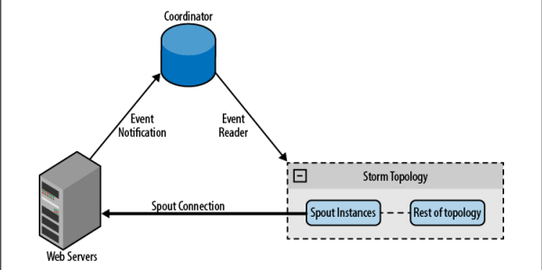

# Spouts  
  
你将在本章了解到 *spout* 作为拓扑入口和它的容错机制相关的最常见的设计策略。

## 可靠的消息 VS 不可靠的消息

在设计拓扑结构时，始终在头脑中记着的一件重要事情就是消息的可靠性。当有无法处理的消息时，你就要决定该怎么办，以及作为一个整体的拓扑结构该做些什么。举个例子，在处理银行存款时，不要丢失任何事务报文就是很重要的事情。但是如果你要统计分析数以百万的 tweeter 消息，即使有一条丢失了，仍然可以认为你的结果是准确的。

对于 Storm 来说，根据每个拓扑的需要担保消息的可靠性是开发者的责任。这就涉及到消息可靠性和资源消耗之间的权衡。高可靠性的拓扑必须管理丢失的消息，必然消耗更多资源；可靠性较低的拓扑可能会丢失一些消息，占用的资源也相应更少。不论选择什么样的可靠性策略，Storm 都提供了不同的工具来实现它。

要在 spout 中管理可靠性，你可以在分发时包含一个元组的消息 ID（**collector.emit(new Values(…),tupleId)**）。在一个元组被正确的处理时调用 ack**** 方法，而在失败时调用 **fail** 方法。当一个元组被所有的靶 bolt 和锚 bolt 处理过，即可判定元组处理成功（你将在第5章学到更多锚 bolt 知识）。

发生下列情况之一时为元组处理失败：

- 提供数据的 spout 调用 **collector.fail(tuple)**
- 处理时间超过配置的超时时间  

让我们来看一个例子。想象你正在处理银行事务，需求如下：

- 如果事务失败了，重新发送消息
- 如果失败了太多次，终结拓扑运行  

创建一个 spout 和一个 bolt，spout 随机发送100个事务 ID，有80%的元组不会被 bolt 收到（你可以在[例子 ch04-spout ](https://github.com/storm-book/examples-ch04-spouts/)查看完整代码）。实现 spout 时利用 **Map** 分发事务消息元组，这样就比较容易实现重发消息。
  
```
public void nextTuple() {
    if(!toSend.isEmpty()){
        for(Map.Entry<Integer, String> transactionEntry : toSend.entrySet()){
            Integer transactionId = transactionEntry.getKey();
            String transactionMessage = transactionEntry.getValue();
            collector.emit(new Values(transactionMessage),transactionId);
        }
        toSend.clear();
    }
}  
```  

如果有未发送的消息，得到每条事务消息和它的关联 ID，把它们作为一个元组发送出去，最后清空消息队列。值得一提的是，调用 map 的 **clear** 是安全的，因为 **nextTuple** 失败时，只有 **ack** 方法会修改 map，而它们都运行在一个线程内。

维护两个 map 用来跟踪待发送的事务消息和每个事务的失败次数。**ack** 方法只是简单的把事务从每个列表中删除。
  
```
public void ack(Object msgId) {
    messages.remove(msgId);
    failCounterMessages.remove(msgId);
}  
```  

**fail** 方法决定应该重新发送一条消息，还是已经失败太多次而放弃它。

**NOTE**:如果你使用全部数据流组，而拓扑里的所有 bolt 都失败了，spout 的 **fail** 方法才会被调用。
  
```
public void fail(Object msgId) {
    Integer transactionId = (Integer) msgId;
    //检查事务失败次数
    Integer failures = transactionFailureCount.get(transactionId) + 1;

    if(failes >= MAX_FAILS){
        //失败数太高了，终止拓扑
        throw new RuntimeException("错误, transaction id 【"+

         transactionId+"】 已失败太多次了 【"+failures+"】");
    }

    //失败次数没有达到最大数，保存这个数字并重发此消息
    transactionFailureCount.put(transactionId, failures);
    toSend.put(transactionId, messages.get(transactionId));
    LOG.info("重发消息【"+msgId+"】");
}  
```  

首先，检查事务失败次数。如果一个事务失败次数太多，通过抛出 **RuntimeException** 终止发送此条消息的工人。否则，保存失败次数，并把消息放入待发送队列（**toSend**），它就会再次调用 **nextTuple** 时得以重新发送。  

**NOTE**:Storm 节点不维护状态，因此如果你在内存保存信息（就像本例做的那样），而节点又不幸挂了，你就会丢失所有缓存的消息。
Storm 是一个快速失败的系统。拓扑会在抛出异常时挂掉，然后再由 Storm 重启，恢复到抛出异常前的状态。

## 获取数据  

接下来你会了解到一些设计 spout 的技巧，帮助你从多数据源获取数据。

### 直接连接

在一个直接连接的架构中，spout 直接与一个消息分发器连接。
  
  

图 直接连接的 spout

这个架构很容易实现，尤其是在消息分发器是已知设备或已知设备组时。已知设备满足：拓扑从启动时就已知道该设备，并贯穿拓扑的整个生命周期保持不变。未知设备就是在拓扑运行期添加进来的。已知设备组就是从拓扑启动时组内所有设备都是已知的。

下面举个例子说明这一点。创建一个 spout 使用 [Twitter 流 API](https://github.com/storm-book/examples-ch04-spouts/) 读取 twitter 数据流。spout 把 API 当作消息分发器直接连接。从数据流中得到符合 track 参数的公共 tweets（参考 twitter 开发页面）。完整的例子可以在链接 [https://github.com/storm-book/examples-ch04-spouts/](https://github.com/storm-book/examples-ch04-spouts/)找到。

spout 从配置对象得到连接参数（track，user，password)，并连接到 API（在这个例子中使用 [Apache](http://apache.org/) 的 [DefaultHttpClient](http://hc.apache.org/httpcomponents-client-ga/httpclient/apidocs/org/apache/http/impl/client/DefaultHttpClient.html)）。它一次读一行数据，并把数据从 JSON 转化成 Java 对象，然后发布它。
  
```
public void nextTuple() {
    //创建http客户端
    client = new DefaultHttpClient();
    client.setCredentialsProvider(credentialProvider);
    HttpGet get = new HttpGet(STREAMING_API_URL+track);
    HttpResponse response;
    try {
        //执行http访问
        response = client.execute(get);
        StatusLine status = response.getStatusLine();
        if(status.getStatusCode() == 200){
            InputStream inputStream = response.getEntity().getContent();
            BufferedReader reader = new BufferedReader(new InputStreamReader(inputStream));
            String in;
            //逐行读取数据
            while((in = reader.readLine())!=null){
                try{
                    //转化并发布消息
                    Object json = jsonParser.parse(in);
                    collector.emit(new Values(track,json));
                }catch (ParseException e) {
                    LOG.error("Error parsing message from twitter",e);
                }
            }
        }
    } catch (IOException e) {
        LOG.error("Error in communication with twitter api ["+get.getURI().toString()+"], 
           sleeping 10s");
        try {
            Thread.sleep(10000);
        } catch (InterruptedException e1) {}
    }
}  
```  

**NOTE**:在这里你锁定了 **nextTuple** 方法，所以你永远也不会执行 ack**** 和 **fail** 方法。在真实的应用中，我们推荐你在一个单独的线程中执行锁定，并维持一个内部队列用来交换数据（你会在下一个例子中学到如何实现这一点：消息队列）。

棒极了！
现在你用一个 spout 读取 Twitter 数据。一个明智的做法是，采用拓扑并行化，多个 spout 从同一个流读取数据的不同部分。那么如果你有多个流要读取，你该怎么做呢？Storm 的第二个有趣的特性（译者注：第一个有趣的特性已经出现过，这句话原文都是一样的，不过按照中文的行文习惯还是不重复使用措词了）是，你可以在任意组件内（spouts/bolts）访问**TopologyContext**。利用这一特性，你能够把流划分到多个 spouts 读取。
  
```
public void open(Map conf, TopologyContext context,
          SpoutOutputCollector collector) {
    //从context对象获取spout大小
    int spoutsSize = 
context.getComponentTasks(context.getThisComponentId()).size();
    //从这个spout得到任务id
    int myIdx = context.getThisTaskIndex();
    String[] tracks = ((String) conf.get("track")).split(",");
    StringBuffer tracksBuffer = new StringBuffer();
    for(int i=0; i< tracks.length;i++){
        //Check if this spout must read the track word
        if( i % spoutsSize == myIdx){
            tracksBuffer.append(",");
            tracksBuffer.append(tracks[i]);
        }
    }
    if(tracksBuffer.length() == 0) {
        throw new RuntimeException("没有为spout得到track配置" +
 " [spouts大小:"+spoutsSize+", tracks:"+tracks.length+"] tracks的数量必须高于spout的数量");
 this.track =tracksBuffer.substring(1).toString();
    }
 ...
 }  
```  

利用这一技巧，你可以把 collector 对象均匀的分配给多个数据源，当然也可以应用到其它的情形。比如说，从web服务器收集日志文件
  
  

图 直连 hash

通过上一个例子，你学会了从一个 spout 连接到已知设备。你也可以使用相同的方法连接未知设备，不过这时你需要借助于一个协同系统维护的设备列表。协同系统负责探察列表的变化，并根据变化创建或销毁连接。比如，从 web 服务器收集日志文件时，web 服务器列表可能随着时间变化。当添加一台 web 服务器时，协同系统探查到变化并为它创建一个新的 spout。
  
  

图 直连协同

### 消息队列

第二种方法是，通过一个队列系统接收来自消息分发器的消息，并把消息转发给 spout。更进一步的做法是，把队列系统作为 spout 和数据源之间的中间件，在许多情况下，你可以利用多队列系统的重播能力增强队列可靠性。这意味着你不需要知道有关消息分发器的任何事情，而且添加或移除分发器的操作比直接连接简单的多。这个架构的问题在于队列是一个故障点，另外你还要为处理流程引入新的环节。

下图展示了这一架构模型
  
  

图 使用队列系统

**NOTE**:你可以通过轮询队列或哈希队列（把队列消息通过哈希发送给 spouts 或创建多个队列使队列 spouts 一一对应）在多个 spouts 之间实现并行性。

接下来我们利用 Redis[http://redis.io/](http://redis.io/) 和它的 java 库 [Jedis](https://github.com/xetorthio/jedis) 创建一个队列系统。在这个例子中，我们创建一个日志处理器从一个未知的来源收集日志，利用 **lpush** 命令把消息插入队列，利用 blpop 命令等待消息。如果你有很多处理过程，**blpop** 命令采用了轮询方式获取消息。

我们在 spout 的 open**** 方法创建一个线程，用来获取消息（使用线程是为了避免锁定**nextTuple** 在主循环的调用）：
  
```
new Thread(new Runnable() {
    @Override
    public void run() {
        try{
           Jedis client= new Jedis(redisHost, redisPort);
           List res = client.blpop(Integer.MAX_VALUE, queues);
           messages.offer(res.get(1));
        }catch(Exception e){
            LOG.error("从redis读取队列出错",e);
            try {
                Thread.sleep(100);
            }catch(InterruptedException e1){}
        }
    }
}).start();  
```  

这个线程的惟一目的就是，创建 redis 连接，然后执行 **blpop** 命令。每当收到了一个消息，它就被添加到一个内部消息队列，然后会被 nextTuple**** 消费。对于 spout 来说数据源就是 redis 队列，它不知道消息分发者在哪里也不知道消息的数量。

**NOTE**:我们不推荐你在 spout 创建太多线程，因为每个 spout 都运行在不同的线程。一个更好的替代方案是增加拓扑并行性，也就是通过 Storm 集群在分布式环境创建更多线程。

在 **nextTupl**e 方法中，要做的惟一的事情就是从内部消息队列获取消息并再次分发它们。
  
```
public void nextTuple(){
    while(!messages.isEmpty()){
        collector.emit(new Values(messages.poll()));
    }
}  
```  

**NOTE**:你还可以借助 redis 在 spout 实现消息重发，从而实现可靠的拓扑。（译者注：这里是相对于开头的**可靠的消息VS不可靠的消息**讲的）

## DRPC

DRPCSpout从DRPC 服务器接收一个函数调用，并执行它（见第三章的例子）。对于最常见的情况，使用 [backtype.storm.drpc.DRPCSpout](http://nathanmarz.github.io/storm/doc/backtype/storm/drpc/DRPCSpout.html) 就足够了，不过仍然有可能利用 Storm 包内的DRPC类创建自己的实现。

## 小结

现在你已经学习了常见的spout实现模式，它们的优势，以及如何确保消息可靠性。不存在适用于所有拓扑的架构模式。如果你知道数据源，并且能够控制它们，你就可以使用直接连接；然而如果你需要添加未知数据源或从多种数据源接收数据，就最好使用消息队列。如果你要执行在线过程，你可以使用 DRPCSpout 或类似的实现。

你已经学习了三种常见连接方式，不过依赖于你的需求仍然有无限的可能。