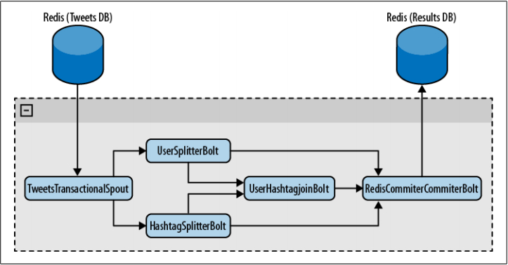

# 事务性拓扑  
  
正如书中之前所提到的，使用 Storm 编程，可以通过调用 ack 和 fail 方法来确保一条消息的处理成功或失败。不过当元组被重发时，会发生什么呢？你又该如何砍不会重复计算？ 

Storm0.7.0 实现了一个新特性——事务性拓扑，这一特性使消息在语义上确保你可以安全的方式重发消息，并保证它们只会被处理一次。在不支持事务性拓扑的情况下，你无法在准确性，可扩展性，以空错性上得到保证的前提下完成计算。

**NOTE**:事务性拓扑是一个构建于标准 Storm spout 和 bolt 之上的抽象概念。

## 设计

在事务性拓扑中，Storm 以并行和顺序处理混合的方式处理元组。spout 并行分批创建供 bolt 处理的元组（译者注：下文将这种分批创建、分批处理的元组称做批次）。其中一些 bolt 作为提交者以严格有序的方式提交处理过的批次。这意味着如果你有每批五个元组的两个批次，将有两个元组被 bolt 并行处理，但是直到提交者成功提交了第一个元组之后，才会提交第二个元组。       
**NOTE**： 使用事务性拓扑时，数据源要能够重发批次，有时候甚至要重复多次。因此确认你的数据源——你连接到的那个 spout ——具备这个能力。 这个过程可以被描述为两个阶段： 处理阶段 纯并行阶段，许多批次同时处理。 提交阶段 严格有序阶段，直到批次一成功提交之后，才会提交批次二。 这两个阶段合起来称为一个 Storm 事务。 **NOTE**： Storm 使用 zookeeper 储存事务元数据，默认情况下就是拓扑使用的那个 zookeeper。你可以修改以下两个配置参数键指定其它的 zookeeper——transactional.zookeeper.servers 和transactional.zookeeper.port。

## 事务实践

下面我们要创建一个 Twitter 分析工具来了解事务的工作方式。我们从一个 Redis 数据库读取tweets，通过几个 bolt 处理它们，最后把结果保存在另一个 Redis 数据库的列表中。处理结果就是所有话题和它们的在 tweets 中出现的次数列表，所有用户和他们在 tweets 中出现的次数列表，还有一个包含发起话题和频率的用户列表。 这个工具的拓扑图。   
  

  
图 拓扑概览

正如你看到的，**TweetsTransactionalSpout** 会连接你的 tweet 数据库并向拓扑分发批次。**UserSplitterBolt** 和 **HashTagSplitterBolt** 两个 bolt，从 spout 接收元组。UserSplitterBolt 解析 tweets 并查找用户——以 @ 开头的单词——然后把这些单词分发到名为 users 的自定义数据流组。**HashtagSplitterBolt** 从 tweet 查找 # 开头的单词，并把它们分发到名为 hashtags 的自定义数据流组。第三个 bolt，**UserHashtagJoinBolt**，接收前面提到的两个数据流组，并计算具名用户的一条 tweet 内的话题数量。为了计数并分发计算结果，这是个 **BaseBatchBolt**（稍后有更多介绍）。

最后一个 bolt——**RedisCommitterBolt**—— 接收以上三个 bolt 的数据流组。它为每样东西计数，并在对一个批次完成处理时，把所有结果保存到 redis。这是一种特殊的 bolt，叫做提交者，在本章后面做更多讲解。

用 **TransactionalTopologyBuilder** 构建拓扑，代码如下：
  
```
01
TransactionalTopologyBuilder builder=
02
    new TransactionalTopologyBuilder("test", "spout", new TweetsTransactionalSpout());
03
 
04
builder.setBolt("users-splitter", new UserSplitterBolt(), 4).shuffleGrouping("spout");
05
buildeer.setBolt("hashtag-splitter", new HashtagSplitterBolt(), 4).shuffleGrouping("spout");
06
 
07
builder.setBolt("users-hashtag-manager", new UserHashtagJoinBolt(), r)
08
       .fieldsGrouping("users-splitter", "users", new Fields("tweet_id"))
09
       .fieldsGrouping("hashtag-splitter", "hashtags", new Fields("tweet_id"));
10
 
11
builder.setBolt("redis-commiter", new RedisCommiterBolt())
12
       .globalGrouping("users-splitter", "users")
13
       .globalGrouping("hashtag-splitter", "hashtags")
14
       .globalGrouping("user-hashtag-merger");  
```  

接下来就看看如何在一个事务性拓扑中实现 spout。

## Spout

一个事务性拓扑的 spout 与标准 spout 完全不同。
  
```
1
public class TweetsTransactionalSpout extends BaseTransactionalSpout<TransactionMetadata>{  
```  

正如你在这个类定义中看到的，TweetsTransactionalSpout 继承了带范型的**BaseTransactionalSpout**。指定的范型类型的对象是事务元数据集合。它将在后面的代码中用于从数据源分发批次。

在这个例子中，**TransactionMetadata** 定义如下：
  
```
01
public class TransactionMetadata implements Serializable {
02
    private static final long serialVersionUID = 1L;
03
    long from;
04
    int quantity;
05
 
06
    public TransactionMetadata(long from, int quantity) {
07
        this.from = from;
08
        this.quantity = quantity;
09
    }
10
}  
```  

该类的对象维护着两个属性 **from** 和 **quantity**，它们用来生成批次。

spout 的最后需要实现下面的三个方法：
  
```
01
@Override
02
public ITransactionalSpout.Coordinator<TransactionMetadata> getCoordinator(
03
       Map conf, TopologyContext context) {
04
    return new TweetsTransactionalSpoutCoordinator();
05
}
06
 
07
@Override
08
public backtype.storm.transactional.ITransactionalSpout.Emitter<TransactionMetadata> getEmitter(Map conf, TopologyContext contest) {
09
    return new TweetsTransactionalSpoutEmitter();
10
}
11
 
12
@Override
13
public void declareOutputFields(OuputFieldsDeclarer declarer) {
14
    declarer.declare(new Fields("txid", "tweet_id", "tweet"));
15
}  
```  

**getCoordinator** 方法，告诉 Storm 用来协调生成批次的类。**getEmitter**，负责读取批次并把它们分发到拓扑中的数据流组。最后，就像之前做过的，需要声明要分发的域。

## RQ 类  

为了让例子简单点，我们决定用一个类封装所有对 Redis 的操作。
  
```
01
public class RQ {
02
    public static final String NEXT_READ = "NEXT_READ";
03
    public static final String NEXT_WRITE = "NEXT_WRITE";
04
 
05
    Jedis jedis;
06
 
07
    public RQ() {
08
        jedis = new Jedis("localhost");
09
    }
10
 
11
    public long getavailableToRead(long current) {
12
        return getNextWrite() - current;
13
    }
14
 
15
    public long getNextRead() {
16
        String sNextRead = jedis.get(NEXT_READ);
17
        if(sNextRead == null) {
18
            return 1;
19
        }
20
        return Long.valueOf(sNextRead);
21
    }
22
 
23
    public long getNextWrite() {
24
        return Long.valueOf(jedis.get(NEXT_WRITE));
25
    }
26
 
27
    public void close() {
28
        jedis.disconnect();
29
    }
30
 
31
    public void setNextRead(long nextRead) {
32
        jedis.set(NEXT_READ, ""+nextRead);
33
    }
34
 
35
    public List<String> getMessages(long from, int quantity) {
36
        String[] keys = new String[quantity];
37
        for (int i = 0; i < quantity; i++) {
38
            keys[i] = ""+(i+from);
39
        }
40
        return jedis.mget(keys);
41
    }
42
}  
```  

仔细阅读每个方法，确保自己理解了它们的用处。

## 协调者 Coordinator  

下面是本例的协调者实现。  

```
01
public static class TweetsTransactionalSpoutCoordinator implements ITransactionalSpout.Coordinator<TransactionMetadata> {
02
    TransactionMetadata lastTransactionMetadata;
03
    RQ rq = new RQ();
04
    long nextRead = 0;
05
 
06
    public TweetsTransactionalSpoutCoordinator() {
07
        nextRead = rq.getNextRead();
08
    }
09
 
10
    @Override
11
    public TransactionMetadata initializeTransaction(BigInteger txid, TransactionMetadata prevMetadata) {
12
        long quantity = rq.getAvailableToRead(nextRead);
13
        quantity = quantity > MAX_TRANSACTION_SIZE ? MAX_TRANSACTION_SIZE : quantity;
14
        TransactionMetadata ret = new TransactionMetadata(nextRead, (int)quantity);
15
        nextRead += quantity;
16
        return ret;
17
    }
18
 
19
    @Override
20
    public boolean isReady() {
21
        return rq.getAvailableToRead(nextRead) > 0;
22
    }
23
 
24
    @Override
25
    public void close() {
26
        rq.close();
27
    }
28
}  
```  

值得一提的是，在整个拓扑中只会有一个提交者实例。创建提交者实例时，它会从 redis 读取一个从1开始的序列号，这个序列号标识要读取的 tweet 下一条。

第一个方法是 **isReady**。在 **initializeTransaction** 之前调用它确认数据源已就绪并可读取。此方法应当相应的返回 **true** 或 **false**。在此例中，读取 tweets 数量并与已读数量比较。它们之间的不同就在于可读 tweets 数。如果它大于0，就意味着还有 tweets 未读。

最后，执行 **initializeTransaction**。正如你看到的，它接收 **txid** 和 **prevMetadata**作为参数。第一个参数是 Storm 生成的事务 ID，作为批次的惟一性标识。**prevMetadata** 是协调器生成的前一个事务元数据对象。

在这个例子中，首先确认有多少 tweets 可读。只要确认了这一点，就创建一个TransactionMetadata 对象，标识读取的第一个 tweet（译者注：对象属性 **from** ），以及读取的 tweets 数量（译者注：对象属性 **quantity** ）。

元数据对象一经返回，Storm 把它跟 **txid** 一起保存在 zookeeper。这样就确保了一旦发生故障，Storm 可以利用分发器(译者注：**Emitter**，见下文)重新发送批次。
  
## Emitter

创建事务性 spout 的最后一步是实现分发器（Emitter）。实现如下：
  
```
01
public static class TweetsTransactionalSpoutEmitter implements ITransactionalSpout.Emitter<TransactionMetadata> {
02
 
03
</pre>
04
<pre>    RQ rq = new RQ();</pre>
05
<pre>    public TweetsTransactionalSpoutEmitter() {}</pre>
06
<pre>    @Override
07
    public void emitBatch(TransactionAttempt tx, TransactionMetadata coordinatorMeta, BatchOutputCollector collector) {
08
        rq.setNextRead(coordinatorMeta.from+coordinatorMeta.quantity);
09
        List<String> messages = rq.getMessages(coordinatorMeta.from, <span style="font-family: Georgia, 'Times New Roman', 'Bitstream Charter', Times, serif; font-size: 13px; line-height: 19px;">coordinatorMeta.quantity);
10
</span>        long tweetId = coordinatorMeta.from;
11
        for (String message : messages) {
12
            collector.emit(new Values(tx, ""+tweetId, message));
13
            tweetId++;
14
        }
15
    }
16
 
17
    @Override
18
    public void cleanupBefore(BigInteger txid) {}
19
 
20
    @Override
21
    public void close() {
22
        rq.close();
23
    }</pre>
24
<pre>
25
}  
```  

分发器从数据源读取数据并从数据流组发送数据。分发器应当问题能够为相同的事务 id 和事务元数据发送相同的批次。这样，如果在处理批次的过程中发生了故障，Storm 就能够利用分发器重复相同的事务 id 和事务元数据，并确保批次已经重复过了。Storm 会在**TransactionAttempt** 对象里为尝试次数增加计数（译者注：**attempt id** ）。这样就能知道批次已经重复过了。

在这里 **emitBatch** 是个重要方法。在这个方法中，使用传入的元数据对象从 redis 得到tweets，同时增加 redis 维持的已读 tweets 数。当然它还会把读到的 tweets 分发到拓扑。

## Bolts

首先看一下这个拓扑中的标准 bolt：
  
```
01
public class UserSplitterBolt implements IBasicBolt{
02
    private static final long serialVersionUID = 1L;
03
 
04
    @Override
05
    public void declareOutputFields(OutputFieldsDeclarer declarer) {
06
        declarer.declareStream("users", new Fields("txid","tweet_id","user"));
07
    }
08
 
09
    @Override
10
    public Map<String, Object> getComponentConfiguration() {
11
        return null;
12
    }
13
 
14
    @Override
15
    public void prepare(Map stormConf, TopologyContext context) {}
16
 
17
    @Override
18
    public void execute(Tuple input, BasicOutputCollector collector) {
19
        String tweet = input.getStringByField("tweet");
20
        String tweetId = input.getStringByField("tweet_id");
21
        StringTokenizer strTok = new StringTokenizer(tweet, " ");
22
        HashSet<String> users = new HashSet<String>();
23
 
24
        while(strTok.hasMoreTokens()) {
25
            String user = strTok.nextToken();
26
 
27
            //确保这是个真实的用户，并且在这个tweet中没有重复
28
            if(user.startsWith("@") && !users.contains(user)) {
29
                collector.emit("users", new Values(tx, tweetId, user));
30
                users.add(user);
31
            }
32
        }
33
    }
34
 
35
    @Override
36
    public void cleanup(){}
37
}  
```  

正如本章前面提到的，**UserSplitterBolt** 接收元组，解析 tweet 文本，分发 @ 开头的单词————tweeter 用户。**HashtagSplitterBolt** 的实现也非常相似。
  
```
01
public class HashtagSplitterBolt implements IBasicBolt{
02
    private static final long serialVersionUID = 1L;
03
 
04
    @Override
05
    public void declareOutputFields(OutputFieldsDeclarer declarer) {
06
        declarer.declareStream("hashtags", new Fields("txid","tweet_id","hashtag"));
07
    }
08
 
09
    @Override
10
    public Map<String, Object> getComponentConfiguration() {
11
        return null;
12
    }
13
 
14
    @Override
15
    public void prepare(Map stormConf, TopologyContext context) {}
16
 
17
    @Oerride
18
    public void execute(Tuple input, BasicOutputCollector collector) {
19
        String tweet = input.getStringByField("tweet");
20
        String tweetId = input.getStringByField("tweet_id");
21
        StringTokenizer strTok = new StringTokenizer(tweet, " ");
22
        TransactionAttempt tx = (TransactionAttempt)input.getValueByField("txid");
23
        HashSet<String> words = new HashSet<String>();
24
 
25
        while(strTok.hasMoreTokens()) {
26
            String word = strTok.nextToken();
27
 
28
            if(word.startsWith("#") && !words.contains(word)){
29
                collector.emit("hashtags", new Values(tx, tweetId, word));
30
                words.add(word);
31
            }
32
        }
33
    }
34
 
35
    @Override
36
    public void cleanup(){}
37
}  
```  

现在看看 **UserHashTagJoinBolt** 的实现。首先要注意的是它是一个 **BaseBatchBolt**。这意味着，**execute** 方法会操作接收到的元组，但是不会分发新的元组。批次完成时，Storm 会调用 **finishBatch** 方法。
  
```
01
public void execute(Tuple tuple) {
02
    String source = tuple.getSourceStreamId();
03
    String tweetId = tuple.getStringByField("tweet_id");
04
 
05
    if("hashtags".equals(source)) {
06
        String hashtag = tuple.getStringByField("hashtag");
07
        add(tweetHashtags, tweetId, hashtag);
08
    } else if("users".equals(source)) {
09
        String user = tuple.getStringByField("user");
10
        add(userTweets, user, tweetId);
11
    }
12
}  
```  

既然要结合 tweet 中提到的用户为出现的所有话题计数，就需要加入前面的 bolts 创建的两个数据流组。这件事要以批次为单位进程，在批次处理完成时，调用 **finishBatch** 方法。
  
```
01
@Override
02
public void finishBatch() {
03
    for(String user:userTweets.keySet()){
04
        Set<String> tweets = getUserTweets(user);
05
        HashMap<String, Integer> hashtagsCounter = new HashMap<String, Integer>();
06
        for(String tweet:tweets){
07
            Set<String> hashtags=getTweetHashtags(tweet);
08
            if(hashtags!=null){
09
                for(String hashtag:hashtags){
10
                    Integer count=hashtagsCounter.get(hashtag);
11
                    if(count==null){count=0;}
12
                    count++;
13
                    hashtagsCounter.put(hashtag,count);
14
                }
15
            }
16
        }
17
        for(String hashtag:hashtagsCounter.keySet()){
18
            int count=hashtagsCounter.get(hashtag);
19
            collector.emit(new Values(id,user,hashtag,count));
20
        }
21
    }
22
}  
```  

这个方法计算每对用户-话题出现的次数，并为之生成和分发元组。

你可以在 GitHub 上找到并下载完整代码。（译者注：https://github.com/storm-book/examples-ch08-transactional-topologies 这个仓库里没有代码，谁知道哪里有代码麻烦说一声。）

## 提交者 bolts

我们已经学习了，批次通过协调器和分发器怎样在拓扑中传递。在拓扑中，这些批次中的元组以并行的，没有特定次序的方式处理。

协调者 bolts 是一类特殊的批处理 bolts，它们实现了 **IComh mitter **或者通过**TransactionalTopologyBuilder** 调用 **setCommiterBolt** 设置了提交者 bolt。它们与其它的批处理 bolts 最大的不同在于，提交者 bolts的finishBatch 方法在提交就绪时执行。这一点发生在之前所有事务都已成功提交之后。另外，**finishBatch** 方法是顺序执行的。因此如果同时有事务 ID1 和事务 ID2 两个事务同时执行，只有在 ID1 没有任何差错的执行了 **finishBatch** 方法之后，ID2 才会执行该方法。

下面是这个类的实现
  
```
01
public class RedisCommiterCommiterBolt extends BaseTransactionalBolt implements ICommitter {
02
    public static final String LAST_COMMITED_TRANSACTION_FIELD = "LAST_COMMIT";
03
    TransactionAttempt id;
04
    BatchOutputCollector collector;
05
    Jedis jedis;
06
 
07
    @Override
08
    public void prepare(Map conf, TopologyContext context,
09
                        BatchOutputCollector collector, TransactionAttempt id) {
10
        this.id = id;
11
        this.collector = collector;
12
        this.jedis = new Jedis("localhost");
13
    }
14
 
15
    HashMap<String, Long> hashtags = new HashMap<String,Long>();
16
    HashMap<String, Long> users = new HashMap<String, Long>();
17
    HashMap<String, Long> usersHashtags = new HashMap<String, Long>();
18
 
19
    private void count(HashMap<String, Long> map, String key, int count) {
20
        Long value = map.get(key);
21
        if(value == null){value = (long)0;}
22
        value += count;
23
        map.put(key,value);
24
    }
25
 
26
    @Override
27
    public void execute(Tuple tuple) {
28
        String origin = tuple. getSourceComponent();
29
        if("sers-splitter".equals(origin)) {
30
            String user = tuple.getStringByField("user");
31
            count(users, user, 1);
32
        } else if("hashtag-splitter".equals(origin)) {
33
            String hashtag = tuple.getStringByField("hashtag");
34
            count(hashtags, hashtag, 1);
35
        } else if("user-hashtag-merger".quals(origin)) {
36
            String hashtag = tuple.getStringByField("hashtag");
37
            String user = tuple.getStringByField("user");
38
            String key = user + ":" + hashtag;
39
            Integer count = tuple.getIntegerByField("count");
40
            count(usersHashtags, key, count);
41
        }
42
    }
43
 
44
    @Override
45
    public void finishBatch() {
46
        String lastCommitedTransaction = jedis.get(LAST_COMMITED_TRANSACTION_FIELD);
47
        String currentTransaction = ""+id.getTransactionId();
48
 
49
        if(currentTransaction.equals(lastCommitedTransaction)) {return;}
50
 
51
        Transaction multi = jedis.multi();
52
 
53
        multi.set(LAST_COMMITED_TRANSACTION_FIELD, currentTransaction);
54
 
55
        Set<String> keys = hashtags.keySet();
56
        for (String hashtag : keys) {
57
            Long count = hashtags.get(hashtag);
58
            multi.hincrBy("hashtags", hashtag, count);
59
        }
60
 
61
        keys = users.keySet();
62
        for (String user : keys) {
63
            Long count =users.get(user);
64
            multi.hincrBy("users",user,count);
65
        }
66
 
67
        keys = usersHashtags.keySet();
68
        for (String key : keys) {
69
            Long count = usersHashtags.get(key);
70
            multi.hincrBy("users_hashtags", key, count);
71
        }
72
 
73
        multi.exec();
74
    }
75
 
76
    @Override
77
    public void declareOutputFields(OutputFieldsDeclarer declarer) {}
78
}  
```  

这个实现很简单，但是在 **finishBatch** 有一个细节。
  
```
1
...
2
multi.set(LAST_COMMITED_TRANSACTION_FIELD, currentTransaction);
3
...  
```   

在这里向数据库保存提交的最后一个事务 ID。为什么要这样做？记住，如果事务失败了，Storm将会尽可能多的重复必要的次数。如果你不确定已经处理了这个事务，你就会多算，事务拓扑也就没有用了。所以请记住：保存最后提交的事务 ID，并在提交前检查。

## 分区的事务 Spouts  

对一个 spout 来说，从一个分区集合中读取批次是很普通的。接着这个例子，你可能有很多redis 数据库，而 tweets 可能会分别保存在这些 redis 数据库里。通过实现**IPartitionedTransactionalSpout**，Storm 提供了一些工具用来管理每个分区的状态并保证重播的能力。  

下面我们修改 **TweetsTransactionalSpout**，使它可以处理数据分区。  

首先，继承 **BasePartitionedTransactionalSpout**，它实现了**IPartitionedTransactionalSpout**。
  
```
1
public class TweetsPartitionedTransactionalSpout extends
2
       BasePartitionedTransactionalSpout<TransactionMetadata> {
3
...
4
}  
```  

然后告诉 Storm 谁是你的协调器。
  
```
01
public static class TweetsPartitionedTransactionalCoordinator implements Coordinator {
02
    @Override
03
    public int numPartitions() {
04
        return 4;
05
    }
06
 
07
    @Override
08
    public boolean isReady() {
09
        return true;
10
    }
11
 
12
    @Override
13
    public void close() {}
14
}  
```  

在这个例子里，协调器很简单。numPartitions 方法，告诉 Storm 一共有多少分区。而且你要注意，不要返回任何元数据。对于 **IPartitionedTransactionalSpout**，元数据由分发器直接管理。  

下面是分发器的实现：
   
```
01
public static class TweetsPartitionedTransactionalEmitter
02
       implements Emitter<TransactionMetadata> {
03
    PartitionedRQ rq = new ParttionedRQ();
04
 
05
    @Override
06
    public TransactionMetadata emitPartitionBatchNew(TransactionAttempt tx,
07
            BatchOutputCollector collector, int partition,
08
            TransactionMetadata lastPartitioonMeta) {
09
        long nextRead;
10
 
11
        if(lastPartitionMeta == null) {
12
            nextRead = rq.getNextRead(partition);
13
        }else{
14
            nextRead = lastPartitionMeta.from + lastPartitionMeta.quantity;
15
            rq.setNextRead(partition, nextRead); //移动游标
16
        }
17
 
18
        long quantity = rq.getAvailableToRead(partition, nextRead);
19
        quantity = quantity > MAX_TRANSACTION_SIZE ? MAX_TRANSACTION_SIZE : quantity;
20
        TransactionMetadata metadata = new TransactionMetadata(nextRead, (int)quantity);
21
 
22
        emitPartitionBatch(tx, collector, partition, metadata);
23
        return metadata;
24
    }
25
 
26
    @Override
27
    public void emitPartitionBatch(TransactionAttempt tx, BatchOutputCollector collector,
28
            int partition, TransactionMetadata partitionMeta) {
29
        if(partitionMeta.quantity <= 0){
30
            return;
31
        }
32
 
33
        List<String> messages = rq.getMessages(partition, partitionMeta.from,
34
               partitionMeta.quantity);
35
 
36
        long tweetId = partitionMeta.from;
37
        for (String msg : messages) {
38
            collector.emit(new Values(tx, ""+tweetId, msg));
39
            tweetId++;
40
        }
41
    }
42
 
43
    @Override
44
    public void close() {}
45
}  
```  

这里有两个重要的方法，**emitPartitionBatchNew**，和 **emitPartitionBatch**。对于 **emitPartitionBatchNew**，从 Storm 接收分区参数，该参数决定应该从哪个分区读取批次。在这个方法中，决定获取哪些 tweets，生成相应的元数据对象，调用 **emitPartitionBatch**，返回元数据对象，并且元数据对象会在方法返回时立即保存到 zookeeper。  

Storm 会为每一个分区发送相同的事务 ID，表示一个事务贯穿了所有数据分区。通过**emitPartitionBatch** 读取分区中的 tweets，并向拓扑分发批次。如果批次处理失败了，Storm 将会调用 **emitPartitionBatch** 利用保存下来的元数据重复这个批次。

**NOTE**: 完整的源码请见[：https://github.com/storm-book/examples-ch08-transactional-topologies](：https://github.com/storm-book/examples-ch08-transactional-topologies)（译者注：原文如此，实际上这个仓库里什么也没有）

## 模糊的事务性拓扑

到目前为止，你可能已经学会了如何让拥有相同事务 ID 的批次在出错时重播。但是在有些场景下这样做可能就不太合适了。然后会发生什么呢？

事实证明，你仍然可以实现在语义上精确的事务，不过这需要更多的开发工作，你要记录由 Storm 重复的事务之前的状态。既然能在不同时刻为相同的事务 ID 得到不同的元组，你就需要把事务重置到之前的状态，并从那里继续。

比如说，如果你为收到的所有 tweets 计数，你已数到5，而最后的事务 ID 是321，这时你多数了8个。你要维护以下三个值 ——previousCount=5,currentCount=13，以及lastTransactionId=321。假设事物 ID321 又发分了一次，而你又得到了4个元组，而不是之前的8个，提交器会探测到这是相同的事务 ID，它将会把结果重置到 previousCount 的值5，并在此基础上加4，然后更新 **currentCount** 为9。

另外，在之前的一个事务被取消时，每个并行处理的事务都要被取消。这是为了确保你没有丢失任何数据。

你的 spout 可以实现 **IOpaquePartitionedTransactionalSpout**，而且正如你看到的，协调器和分发器也很简单。
  
```
01
public static class TweetsOpaquePartitionedTransactionalSpoutCoordinator implements IOpaquePartitionedTransactionalSpout.Coordinator {
02
    @Override
03
    public boolean isReady() {
04
        return true;
05
    }
06
}
07
 
08
public static class TweetsOpaquePartitionedTransactionalSpoutEmitter
09
       implements IOpaquePartitionedTransactionalSpout.Emitter<TransactionMetadata> {
10
    PartitionedRQ rq  = new PartitionedRQ();
11
 
12
    @Override
13
    public TransactionMetadata emitPartitionBatch(TransactionAttempt tx,
14
           BatchOutputCollector collector, int partion,
15
           TransactionMetadata lastPartitonMeta) {
16
        long nextRead;
17
 
18
        if(lastPartitionMeta == null) {
19
            nextRead = rq.getNextRead(partition);
20
        }else{
21
            nextRead = lastPartitionMeta.from + lastPartitionMeta.quantity;
22
            rq.setNextRead(partition, nextRead);//移动游标
23
        }
24
 
25
        long quantity = rq.getAvailabletoRead(partition, nextRead);
26
        quantity = quantity > MAX_TRANSACTION_SIZE ? MAX_TRANSACTION_SIZE : quantity;
27
        TransactionMetadata metadata = new TransactionMetadata(nextRead, (int)quantity);
28
        emitMessages(tx, collector, partition, metadata);
29
        return metadata;
30
    }
31
 
32
    private void emitMessage(TransactionAttempt tx, BatchOutputCollector collector,
33
                 int partition, TransactionMetadata partitionMeta) {
34
        if(partitionMeta.quantity <= 0){return;}
35
 
36
        List<String> messages = rq.getMessages(partition, partitionMeta.from, partitionMeta.quantity);
37
        long tweetId = partitionMeta.from;
38
        for(String msg : messages) {
39
            collector.emit(new Values(tx, ""+tweetId, msg));
40
            tweetId++;
41
        }
42
    }
43
 
44
    @Override
45
    public int numPartitions() {
46
        return 4;
47
    }
48
 
49
    @Override
50
    public void close() {}
51
}  
```  

最有趣的方法是 emitPartitionBatch，它获取之前提交的元数据。你要用它生成批次。这个批次不需要与之前的那个一致，你可能根本无法创建完全一样的批次。剩余的工作由提交器 bolts借助之前的状态完成。