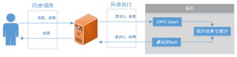

# 拓扑  
  
在这一章，你将学到如何在同一个 Storm 拓扑结构内的不同组件之间传递元组，以及如何向一个运行中的 Storm 集群发布一个拓扑。

## 数据流组

设计一个拓扑时，你要做的最重要的事情之一就是定义如何在各组件之间交换数据（数据流是如何被 *bolts* 消费的）。一个*据数流组*指定了每个 *bolt* 会消费哪些数据流，以及如何消费它们。

**NOTE**：一个节点能够发布一个以上的数据流，一个数据流组允许我们选择接收哪个。

数据流组在定义拓扑时设置，就像我们在第二章看到的：
  
```
···
    builder.setBolt("word-normalizer", new WordNormalizer())
           .shuffleGrouping("word-reader");
···  
```  

在前面的代码块里，一个 bolt 由 **TopologyBuilder** 对象设定， 然后使用随机数据流组指定数据源。数据流组通常将数据源组件的 ID 作为参数，取决于数据流组的类型不同还有其它可选参数。

**NOTE**：每个 **InputDeclarer** 可以有一个以上的数据源，而且每个数据源可以分到不同的组。

## 随机数据流组

随机流组是最常用的数据流组。它只有一个参数（数据源组件），并且数据源会向随机选择的 bolt 发送元组，保证每个消费者收到近似数量的元组。

随机数据流组用于数学计算这样的原子操作。然而，如果操作不能被随机分配，就像第二章为单词计数的例子，你就要考虑其它分组方式了。

## 域数据流组

域数据流组允许你基于元组的一个或多个域控制如何把元组发送给 *bolts*。 它保证拥有相同域组合的值集发送给同一个 *bolt*。 回到单词计数器的例子，如果你用 *word* 域为数据流分组，**word-normalizer** bolt 将只会把相同单词的元组发送给同一个 **word-counter**bolt 实例。
    
```
···
    builder.setBolt("word-counter", new WordCounter(),2)
           .fieldsGrouping("word-normalizer", new Fields("word"));
···  
```  

**NOTE**: 在域数据流组中的所有域集合必须存在于数据源的域声明中。

## 全部数据流组

全部数据流组，为每个接收数据的实例复制一份元组副本。这种分组方式用于向 bolts 发送信号。比如，你要刷新缓存，你可以向所有的 bolts 发送一个刷新缓存信号。在单词计数器的例子里，你可以使用一个全部数据流组，添加清除计数器缓存的功能（见[拓扑示例](https://github.com/storm-book/examples-ch03-topologies)）
  
```
    public void execute(Tuple input) {
        String str = null;
        try{
            if(input.getSourceStreamId().equals("signals")){
                str = input.getStringByField("action");
                if("refreshCache".equals(str))
                    counters.clear();
            }
        }catch (IllegalArgumentException e){
            //什么也不做
        }
        ···
    }  
```  

我们添加了一个 if 分支，用来检查源数据流。 Storm 允许我们声明具名数据流（如果你不把元组发送到一个具名数据流，默认发送到名为 ”**default**“ 的数据流）。这是一个识别元组的极好的方式，就像这*个例子中，我们想识别 **signals** 一样。 在拓扑定义中，你要向 **word-counter** *bolt 添加第二个数据流，用来接收从 **signals-spout** 数据流发送到所有 bolt 实例的每一个元组。
  
```
    builder.setBolt("word-counter", new WordCounter(),2)
           .fieldsGroupint("word-normalizer",new Fields("word"))
           .allGrouping("signals-spout","signals");   
```  

**signals-spout**的实现请参考[git仓库](https://github.com/storm-book/examples-ch03-topologies)。

## 自定义数据流组

你可以通过实现 **backtype.storm.grouping.CustormStreamGrouping** 接口创建自定义数据流组，让你自己决定哪些 *bolt* 接收哪些元组。

让我们修改单词计数器示例，使首字母相同的单词由同一个 **bolt** 接收。
  
```
    public class ModuleGrouping mplents CustormStreamGrouping, Serializable{
        int numTasks = 0;

        @Override
        public List<Integer> chooseTasks(List<Object> values) {
            List<Integer> boltIds = new ArrayList<Integer>();
            if(values.size()>0){
                String str = values.get(0).toString();
                if(str.isEmpty()){
                    boltIds.add(0);
                }else{
                    boltIds.add(str.charAt(0) % numTasks);
                }
            }
            return boltIds;
        }

        @Override
        public void prepare(TopologyContext context, Fields outFields, List<Integer> targetTasks) {
            numTasks = targetTasks.size();
        }
    }  
```  

这是一个 **CustomStreamGrouping** 的简单实现，在这里我们采用单词首字母字符的整数值与任务数的余数，决定接收元组的 bolt。

按下述方式 **word-normalizer** 修改即可使用这个自定义数据流组。
  
```
    builder.setBolt("word-normalizer", new WordNormalizer())
           .customGrouping("word-reader", new ModuleGrouping());  
```  

## 直接数据流组

这是一个特殊的数据流组，数据源可以用它决定哪个组件接收元组。与前面的例子类似，数据源将根据单词首字母决定由哪个 *bolt* 接收元组。要使用直接数据流组，在 **WordNormalizer** *bolt* 中，使用 **emitDirect** 方法代替 **emit**。
  
```
    public void execute(Tuple input) {
        ...
        for(String word : words){
            if(!word.isEmpty()){
                ...
                collector.emitDirect(getWordCountIndex(word),new Values(word));
            }
        }
        //对元组做出应答
        collector.ack(input);
    }

    public Integer getWordCountIndex(String word) {
        word = word.trim().toUpperCase();
        if(word.isEmpty()){
            return 0;
        }else{
            return word.charAt(0) % numCounterTasks;
        }
    }  
```  

在 **prepare** 方法中计算任务数
  
```
    public void prepare(Map stormConf, TopologyContext context, 
                OutputCollector collector) {
        this.collector = collector;
        this.numCounterTasks = context.getComponentTasks("word-counter");
    }  
```  

在拓扑定义中指定数据流将被直接分组：
  
```
    builder.setBolt("word-counter", new WordCounter(),2)
           .directGrouping("word-normalizer");  
```  

## 全局数据流组

全局数据流组把所有数据源创建的元组发送给单一目标实例（即拥有最低 ID 的任务）。

## 不分组

写作本书时（Stom0.7.1 版），这个数据流组相当于随机数据流组。也就是说，使用这个数据流组时，并不关心数据流是如何分组的。

## LocalCluster VS StormSubmitter

到目前为止，你已经用一个叫做 **LocalCluster** 的工具在你的本地机器上运行了一个拓扑。Storm 的基础工具，使你能够在自己的计算机上方便的运行和调试不同的拓扑。但是你怎么把自己的拓扑提交给运行中的 Storm 集群呢？Storm 有一个有趣的功能，在一个真实的集群上运行自己的拓扑是很容易的事情。要实现这一点，你需要把 **LocalCluster** 换成  **StormSubmitter** 并实现 **submitTopology** 方法， 它负责把拓扑发送给集群。

下面是修改后的代码：
  
```
    //LocalCluster cluster = new LocalCluster();
    //cluster.submitTopology("Count-Word-Topology-With-Refresh-Cache", conf, 
    //builder.createTopology());
    StormSubmitter.submitTopology("Count-Word-Topology-With_Refresh-Cache", conf,
            builder.createTopology());
    //Thread.sleep(1000);
    //cluster.shutdown();  
```  

**NOTE**: 当你使用 **StormSubmitter** 时，你就不能像使用 **LocalCluster** 时一样通过代码控制集群了。

接下来，把源码压缩成一个 jar 包，运行 Storm 客户端命令，把拓扑提交给集群。如果你已经使用了 Maven， 你只需要在命令行进入源码目录运行：**mvn package**。

现在你生成了一个 jar 包，使用 **storm jar** 命令提交拓扑（关于如何安装 Storm 客户端请参考附录 A ）。命令格式：**storm jar allmycode.jar org.me.MyTopology arg1 arg2 arg3**。

对于这个例子，在拓扑工程目录下面运行：
  
```
storm jar target/Topologies-0.0.1-SNAPSHOT.jar countword.TopologyMain src/main/resources/words.txt  
```  

通过这些命令，你就把拓扑发布集群上了。

如果想停止或杀死它，运行：
  
```
storm kill Count-Word-Topology-With-Refresh-Cache  
```  

**NOTE**：拓扑名称必须保证惟一性。 

**NOTE**：如何安装Storm客户端，参考附录A

## DRPC 拓扑

有一种特殊的拓扑类型叫做分布式远程过程调用（DRPC），它利用 Storm 的分布式特性执行远程过程调用（RPC）（见下图）。Storm 提供了一些用来实现 DRPC 的工具。第一个是 DRPC 服务器，它就像是客户端和 Storm 拓扑之间的连接器，作为拓扑的 *spout* 的数据源。它接收一个待执行的函数和函数参数，然后对于函数操作的每一个数据块，这个服务器都会通过拓扑分配一个请求 ID 用来识别 RPC 请求。拓扑执行最后的 bolt 时，它必须分配 RPC 请求 ID 和结果，使 DRPC 服务器把结果返回正确的客户端。



**NOTE**：单实例 DRPC 服务器能够执行许多函数。每个函数由一个惟一的名称标识。

Storm 提供的第二个工具（已在例子中用过）是 LineDRPCTopologyBuilder****，一个辅助构建DRPC 拓扑的抽象概念。生成的拓扑创建 **DRPCSpouts** ——它连接到 DRPC 服务器并向拓扑的其它部分分发数据——并包装 *bolts*，使结果从最后一个 *bolt* 返回。依次执行所有添加到**LinearDRPCTopologyBuilder** 对象的 *bolts*。

作为这种类型的拓扑的一个例子，我们创建了一个执行加法运算的进程。虽然这是一个简单的例子，但是这个概念可以扩展到复杂的分布式计算。

bolt 按下面的方式声明输出：
  
```
    public void declareOutputFields(OutputFieldsDeclarer declarer) {
        declarer.declare(new Fields("id","result"));
    }  
```  

因为这是拓扑中惟一的 bolt，它必须发布 RPC ID 和结果。**execute** 方法负责执行加法运算。
  
```
    public void execute(Tuple input) {
        String[] numbers = input.getString(1).split("\\+");
        Integer added = 0;
        if(numbers.length<2){
            throw new InvalidParameterException("Should be at least 2 numbers");
        }
        for(String num : numbers){
            added += Integer.parseInt(num);
        }
        collector.emit(new Values(input.getValue(0),added));
    }  
```  

包含加法 bolt 的拓扑定义如下：
  
```
    public static void main(String[] args) {
        LocalDRPC drpc = new LocalDRPC();

        LinearDRPCTopologyBuilder builder = new LinearDRPCTopologyBuilder("add");
        builder.addBolt(AdderBolt(),2);

        Config conf = new Config();
        conf.setDebug(true);

        LocalCluster cluster = new LocalCluster();
        cluster.submitTopology("drpcder-topology", conf,
            builder.createLocalTopology(drpc));
        String result = drpc.execute("add", "1+-1");
        checkResult(result,0);
        result = drpc.execute("add", "1+1+5+10");
        checkResult(result,17);

        cluster.shutdown();
        drpc.shutdown();
    }  
```  

创建一个 **LocalDRPC** 对象在本地运行 DRPC 服务器。接下来，创建一个拓扑构建器（译者注：LineDRpctopologyBuilder 对象），把 bolt 添加到拓扑。运行 DRPC 对象（LocalDRPC 对象）的 **execute** 方法测试拓扑。

**NOTE**：使用 **DRPCClient** 类连接远程 DRPC 服务器。DRPC 服务器暴露了 [Thrift API](http://thrift.apache.org/)，因此可以跨语言编程；并且不论是在本地还是在远程运行DRPC服务器，它们的 API 都是相同的。 对于采用 Storm 配置的 DRPC 配置参数的 Storm 集群，调用构建器对象的**createRemoteTopology** 向 Storm 集群提交一个拓扑，而不是调用 **createLocalTopology**。